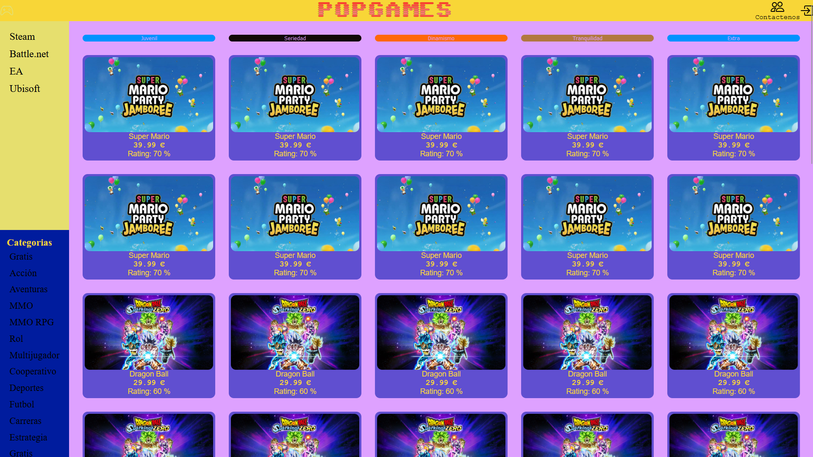
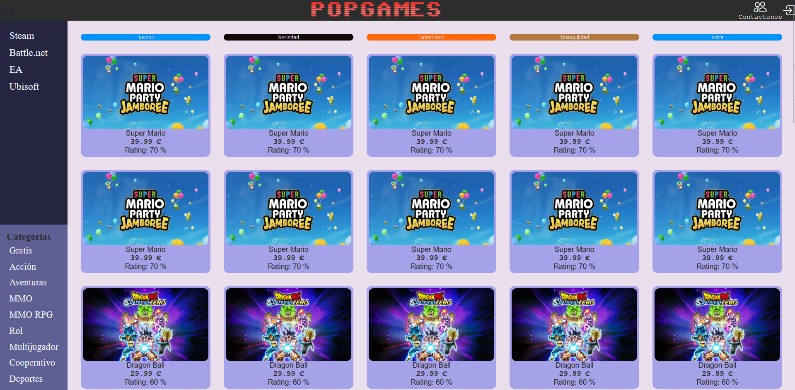
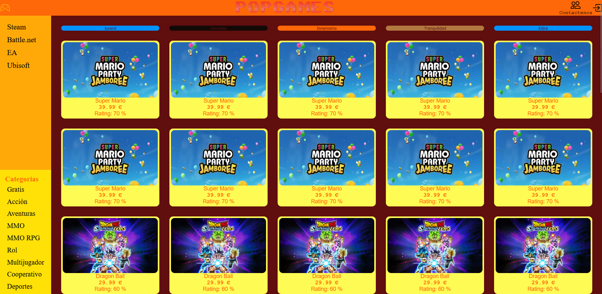
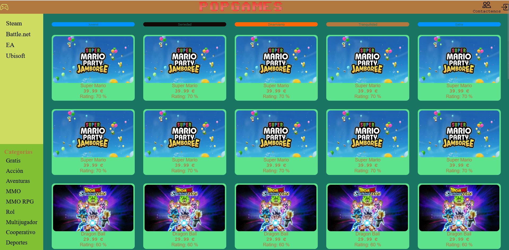
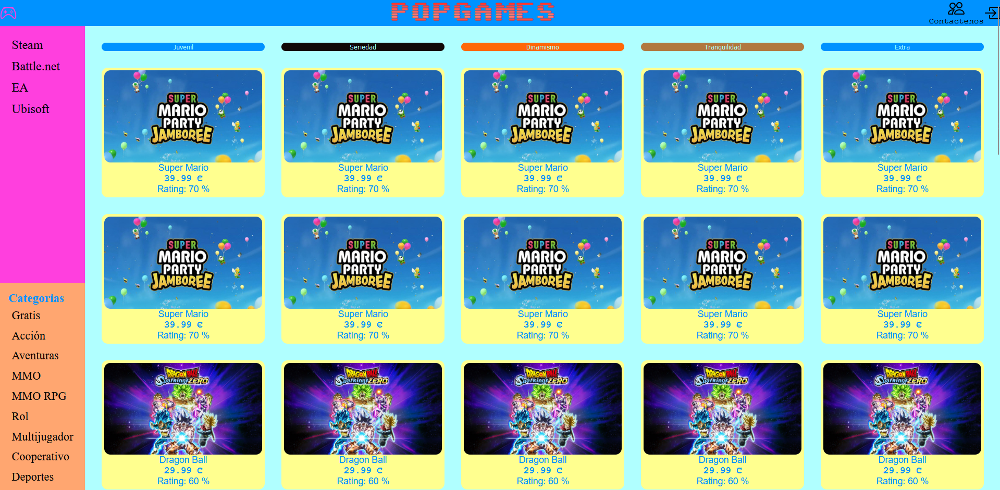

# A2.1.-Paletas-de-colores
 Implementar una aplicación en HTML, Css responsive sobre 40 productos que tenga distintas paletas de colores.
 
 ## Estilo Juvenil

 ## Estilo Seriedad

 ## Estilo Dinamismo

 ## Estilo Tranquilidad

 ## Estilo Extra

